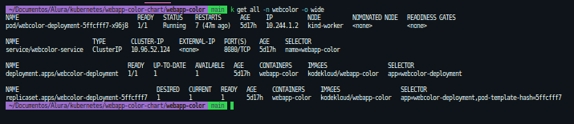

<h1 align="center">Webcolor Kubernetes Helm Chart </h1>

## 1 - Instalação.

### Helm

Para realizar a instalação do (<a href="https://helm.sh/docs/intro/install/">Helm</a>) basta clicar no link.

### Aplicação.

Altere o arquivo <strong>values.yaml</strong> de acordo com sua necessidade e em seguida execute seguinte comando na raiz da aplicação.

```markdown
app:
replicas: 1
color: "blue"
requests:
cpu: "0.1"
memory: "64Mi"
limits:
cpu: "0.1"
memory: "64Mi"
service:
nodePort: "30000"
type: "ClusterIP"
```

`helm install webcolor -f values.yaml -n webcolor --create-namespace`

#### 2 - Verificando a instalação:

`kubectl get all -n webcolor`



#### 3 - Desinstalando chart:

`helm uninstall webcolor -n webcolor`
